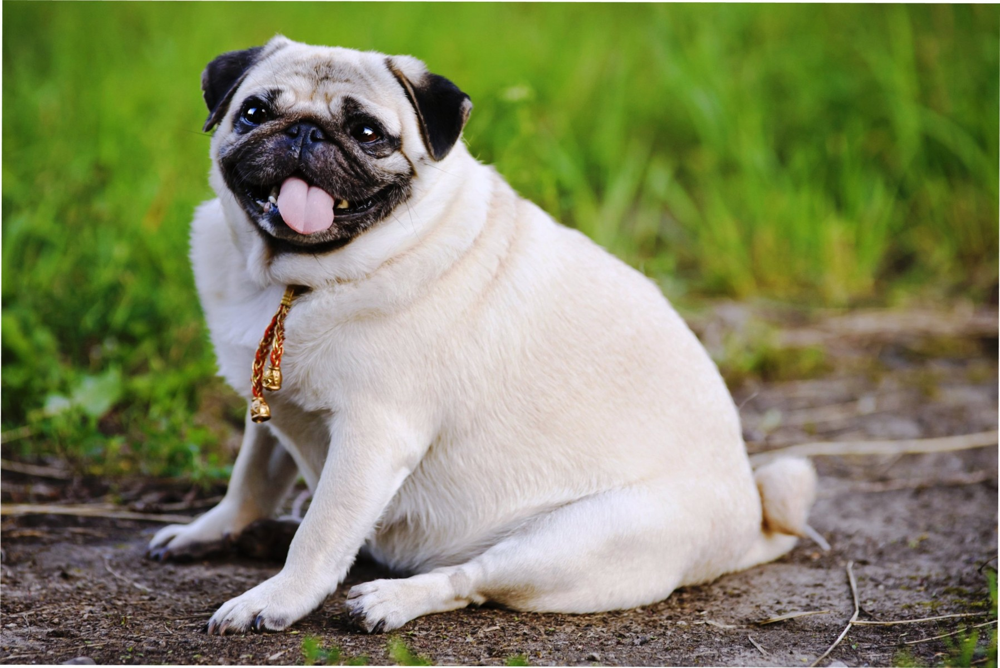

<h2 align="center">  МИНИСТЕРСТВО НАУКИ И ВЫСШЕГО ОБРАЗОВАНИЯ РОССИЙСКОЙ ФЕДЕРАЦИИ ФЕДЕРАЛЬНОЕ ГОСУДАРСТВЕННОЕ БЮДЖЕТНОЕ ОБРАЗОВАТЕЛЬНОЕ УЧРЕЖДЕНИЕ ВЫСШЕГО ОБРАЗОВАНИЯ «САХАЛИНСКИЙ ГОСУДАРСТВЕННЫЙ УНИВЕРСИТЕТ» </h2>
<div align="center">
<h3>Институт естественных наук и техносферной безопасности
<br>
Кафедра информатики
<br>
Половников Владислав Олегович</h3>

<br>
<h3>Лабораторная работа №6
<br>
“Введение в вэб-разработку”
<br>
01.03.02 Прикладная математика и информатика</h3>
<br>
<br>
<br>
<br>
<br>
<br>
<br>
<br>
<br>
<br>
<br>
<br>
<br>
<br>
<h3 align="right">Научный руководитель
<br>
Соболев Евгений Игоревич
</h3>

<h3 align="center">Южно-Сахалинск
<br>
2022г.
</h3>
<hr>
</div>
<p>
HTML (HyperText Markup Language) - язык разметки гипертекста - предназначен для создания Web-страниц.
Под гипертекстом в этом случае понимается текст, связанный с другими текстами указателями-ссылками.
HTML представляет собой достаточно простой набор кодов, которые описывают структуру документа. HTML позволяет выделить в тексте отдельные логические части (заголовки, абзацы, списки и т.д.), поместить на Web-страницу подготовленную фотографию или картинку, организовать на странице ссылки для связи с другими документами.
HTML не задает конкретные и точные атрибуты форматирования документа. Конкретный вид документа окончательно определяет только программа-браузер на компьютере пользователя Интернета. 
HTML также не является языком программирования, но web-страницы могут включать в себя встроенные программы-скрипты на языкахJavascript и Visual Basic Script и программы-апплеты на языке Java.
</p>

<h3 align="center">Задание</h3>

Задачи:
1.	Сделайте alert по нажатию на кнопку.
2.	Сделайте изменение текста в input по нажатию кнопки.
3.	Сделайте вывод содержимого input по нажатию кнопки.
4.	Сделайте кнопку по нажатию на нее, она выводит alert содержимое input, возведенное в квадрат.
5.	Сделайте кнопку по нажатию, она осуществляет обмен содержимым между двумя input.
6.	Сделайте кнопку по нажатию на нее поменяется ее текст.
7.	Сделайте кнопку по нажатию на нее, она меняет цвет текста в input, используя свойства CSS.
8.	Сделайте кнопки по нажатию на них, одна из них блокирует input с помощью атрибута disabled, а другая разблокирует.
9.	Сделайте кнопку при наведении на нее появляется alert.
10.	Сделайте кнопку при двойном на нее появляется alert.
11.	Сделайте область с помощью div при наведении на нее появляется alert.
12.	Сделайте кнопку и картинку, при нажатии кнопки картинка меняется.
13.	Сделайте alert по нажатию на кнопку. Используя this.
14.	Сделайте изменение текста в input по нажатию кнопки. Используя this.
15.	Сделайте кнопку, при нажатии кнопки кнопка блокируется.
16.	Сделайте кнопку, при нажатии кнопка считает количество нажатий на нее.
17.	Сделайте кнопку, при нажатии курсор мышки должен измениться.
18.	Используя JavaScript, сделайте так, чтобы при клике на кнопку исчезал элемент с id=&quot;hide&quot
<!DOCTYPE HTML>
<html>
<head>
    <meta charset="utf-8">
</head>
<body>
    <input type="button" id="hider" value="Нажмите, чтобы спрятать текст"/>
    <div id="hide">Текст</div>
<script>
    /* ваш код */
</script>
</body>
</html>
19.	Создайте кнопку, при клике на которую, она будет скрывать сама себя.
20.	Напишите простой калькулятор.

Задачи CodeWars:
1.	https://www.codewars.com/kata/the-coupon-code
2.	https://www.codewars.com/kata/unlucky-days
3.	https://www.codewars.com/kata/angle-between-clock-hands
4.	https://www.codewars.com/kata/my-language-skills
5.	https://www.codewars.com/kata/run-length-encoding
6.	https://www.codewars.com/kata/walk-the-object-path


<h2 align="center">Решение</h2>

<h3>Файл index.html</h3>

```html
<!DOCTYPE html>
<html lang="en">
<head>
    <meta charset="UTF-8">
    <meta http-equiv="X-UA-Compatible" content="IE=edge">
    <meta name="viewport" content="width=device-width, initial-scale=1.0">
    <link href="https://cdn.jsdelivr.net/npm/bootstrap@5.2.2/dist/css/bootstrap.min.css" rel="stylesheet" integrity="sha384-Zenh87qX5JnK2Jl0vWa8Ck2rdkQ2Bzep5IDxbcnCeuOxjzrPF/et3URy9Bv1WTRi" crossorigin="anonymous">
    <script src="https://cdn.jsdelivr.net/npm/bootstrap@5.2.2/dist/js/bootstrap.bundle.min.js" integrity="sha384-OERcA2EqjJCMA+/3y+gxIOqMEjwtxJY7qPCqsdltbNJuaOe923+mo//f6V8Qbsw3" crossorigin="anonymous"></script>
    <style>
        div{
            margin-bottom: 10px;
            width: 300px;
        }
        div p{
            margin-bottom: 1px;
        }
        div button{
            margin-top: 5px;
        }
        html, body{
            height: 100%;
        }
        html{
            display: table;
            margin: auto;
        }
        body{
            display: table-cell;
            vertical-align: middle;
        }
        table,
        th,
        td {
            border: 1px solid;
            padding: 3px;
            padding-left: 5px;
            padding-right: 5px;
        }
        </style>
    
    <script src="./script.js"></script>
    <script src="./jquery-3.6.1.min.js"></script>

</head>
<body>
    <div>
        <p>Задание 1</p>
        <label for="z1Input" class="form-label">Нажмите на кнопку</label>
        <button type="button" class="btn btn-primary"  onclick="z1()">Считать</button>
        <br>
        <hr>
    </div>

    <div>
        <p>Задание 2</p>
        <label for="z2Input" class="form-label">Нажмите на кнопку для изменения текста</label>
        <input type="text" class="form-control" id="z2Input" value = "22222" disabled name="input1">
        <button type="button" class="btn btn-primary"  onclick="z2(0)">Считать</button>
        <br>
        <hr>
    </div>

    <div>
        <p>Задание 3</p>
        <label for="z3Input" class="form-label">Введите значение</label>
        <input type="text" class="form-control" id="z3Input">
        <button type="button" class="btn btn-primary"  onclick="z3(0)">Считать</button>
        <br>
        <hr>
    </div>

    <div>
        <p>Задание 4</p>
        <label for="z4Input" class="form-label">Введите значение x</label>
        <input type="text" class="form-control" id="z4Input">
        <button type="button" class="btn btn-primary"  onclick="z4(0)">Считать</button>
        <br>
        <label class="form-label" id="z4Label">Ответ: </label>
        <hr>
    </div>

    <div>
        <p>Задание 5</p>
        <label for="z5Input" class="form-label">Введите значения</label>
        <input type="text" class="form-control" id="z5Input1">
        <input type="text" class="form-control" id="z5Input2">
        <button type="button" class="btn btn-primary" onclick="z5()">Считать</button>
        <br>
        <hr>
    </div>

    <div>
        <p>Задание 6</p>
        <button type="button" id ="z6" class="btn btn-primary" onclick="z6()">Нажмите</button>
        <br>

        <hr>
    </div>

    <div>
        <p>Задание 7</p>
        <label for="z7Input" class="form-label">Введите текст</label>
        <input type="text" class="form-control" id="z7Input">
        <button type="button" class="btn btn-primary" onclick="z7()">Считать</button>
        <br>
        <hr>
    </div>

    <div>
        <p>Задание 8</p>
        <label for="z8Input" class="form-label">Нажмите кнопки</label>
        <input type="text" class="form-control" id="z8Input">
        <button type="button" class="btn btn-primary" onclick="z81()">Заблокировать</button>
        <button type="button" class="btn btn-primary" onclick="z82()">Разблокировать</button>
        <br>
        <div id="tablez8"></div>
        <hr>
    </div>

    <div>
        <p>Задание 9</p>
        <label for="z9Input" class="form-label">Нажмите кнопку</label>
        <button type="button" class="btn btn-primary" onmouseover="z9()">Считать</button>
        <br>
        <div id="tablez9"></div>
        <hr>
    </div>
    
    <div>
        <p>Задание 10</p>

        <button type="button" class="btn btn-primary" ondblclick="z10()">Нажать 2 раза</button>
        <br>
        <div id="tablez10"></div>
        <hr>
    </div>

    <div>
        <p>Задание 11</p>
        <div style="height: 200px" onmouseover="z11()"></div>
        <hr>
    </div>
    
    <div>
        <p>Задание 12</p>
        
        <button type="button" class="btn btn-primary" onclick="z12()">Поменять картинку</button>
        <hr>

        <div>
            <p>Задание 13</p>
            <button type="button" class="btn btn-primary" onclick="z13(this)">Нажать</button>
            <br>
            <hr>
        </div>

        <div>
            <p>Задание 14</p>
            <label for="z14Input" class="form-label">Нажмите кнопку</label>
            <input type="text" class="form-control" id="z14Input" onchange="z14(this)">
            <br>
            <hr>
        </div>

        <div>
            <p>Задание 15</p>
            <button type="button" class="btn btn-primary" onclick="z15(this)">Блокировать</button>
            <br>
            <hr>
        </div>

        <div>
            <p>Задание 16</p>
            <label for="z16Input" class="form-label">Нажмите кнопку</label>
            <input type="text" class="form-control" id="z16Input">
            <button type="button" class="btn btn-primary" onclick="z16()">Считать</button>
            <br>
            <label class="form-label" id="z16Label">Ответ: </label>
            <hr>
        </div>

        <div>
            <p>Задание 17</p>
            <label for="z17Input" class="form-label">Нажмите на кнопку</label>
            <button type="button" class="btn btn-primary" onclick="z17()">Считать</button>
            <br>
            <hr>
        </div>

        <div>
            <p>Задание 18</p>
            
            <input type="button" id="hider" value="Нажмите, чтобы спрятать текст" onclick="z18()"/>
            <div id="hide">Текст</div>
            <hr>
        </div>

        <div>
            <p>Задание 19</p>
            <button type="button" class="btn btn-primary" onclick="z19(this)">Нажмите</button>
            <br>
            <hr>
        </div>

        <div>
            <p>Задание 20</p>
            <label for="z20Input" class="form-label">Нажимайте на кнопку</label>
            <input type="text" class="form-control" id="z20Input" disabled = "true">
            <button type="button" class="btn btn-primary" onclick="document.getElementById(`z20Input`).value = ``">C</button>
            <br>
            <button type="button" class="btn btn-primary" onclick="document.getElementById(`z20Input`).value += '1'">1</button>
            <button type="button" class="btn btn-primary" onclick="document.getElementById(`z20Input`).value += '2'">2</button>
            <button type="button" class="btn btn-primary" onclick="document.getElementById(`z20Input`).value += '3'">3</button>
            <button type="button" class="btn btn-primary" onclick="document.getElementById(`z20Input`).value += '*'">*</button>
            <br>
            <button type="button" class="btn btn-primary" onclick="document.getElementById(`z20Input`).value += '4'">4</button>
            <button type="button" class="btn btn-primary" onclick="document.getElementById(`z20Input`).value += '5'">5</button>
            <button type="button" class="btn btn-primary" onclick="document.getElementById(`z20Input`).value += '6'">6</button>
            <button type="button" class="btn btn-primary" onclick="document.getElementById(`z20Input`).value += '-'">-</button>
            <br>
            <button type="button" class="btn btn-primary" onclick="document.getElementById(`z20Input`).value += '7'">7</button>
            <button type="button" class="btn btn-primary" onclick="document.getElementById(`z20Input`).value += '8'">8</button>
            <button type="button" class="btn btn-primary" onclick="document.getElementById(`z20Input`).value += '9'">9</button>
            <button type="button" class="btn btn-primary" onclick="document.getElementById(`z20Input`).value += '+'">+</button>
            <br>
            <button type="button" class="btn btn-primary" onclick="document.getElementById(`z20Input`).value += '00'">00</button>
            <button type="button" class="btn btn-primary" onclick="document.getElementById(`z20Input`).value += '0'">0</button>
            <button type="button" class="btn btn-primary" onclick="z20()">=</button>
            <hr>
        </div>

</body>
</html>
```

<h3>Файл script.js</h3>

```javascript
function z1()
{
    alert("Hello world");
}

function z2()
{
    document.getElementsByName("input1")[0].disabled = false;
}

function z3()
{
    var x = document.getElementById("z3Input").value;

    document.getElementById("z3Label").textContent = "Ответ: " + x;
}

function z4()
{
    var x = document.getElementById("z4Input").value;
    alert(Number(x)*Number(x));
}

function z5()
{
    var x1 = document.getElementById("z5Input1").value;
    var x2 = document.getElementById("z5Input2").value;

    document.getElementById("z5Input1").value = x2;
    document.getElementById("z5Input2").value = x1;
}

function z6()
{

    document.getElementById("z6").textContent = "Hello";
}

function z7()
{
    document.getElementById("z7Input").setAttribute("style","color: blue");

}

function z81()
{
    document.getElementById("z8Input").disabled = true;
}
function z82()
{
    document.getElementById("z8Input").disabled = false;
}

function z9()
{
    alert("Хватит двигать табуретки");
}


function z10()
{
    alert("Хватит двигать табуретки");
}

function z11()
{
    alert("Хватит двигать табуретки");
}

function z12()
{
    
    var str = document.getElementById("img12").src;
    var temp = "";
    for(var i = 0 ; i<5;i++)
    {
        temp+=str[str.length-5+i];
    }
    if(temp == "1.png")
    {
        document.getElementById("img12").src="./2.png";
    }
    else{
        document.getElementById("img12").src="./1.png";
    }
}

function z13(temp)
{
    alert(temp);
}

function z14(input)
{
    input.setAttribute("style","color: blue");
}

function z15(temp)
{
    temp.disabled = true;
}


var CountClicks = 0;
function z16()
{
    CountClicks++;
    document.getElementById("z16Input").value = CountClicks;
}

function z17()
{
 
    document.body.style.cursor = "url('http://wiki-devel.sugarlabs.org/images/e/e2/Arrow.cur'), auto";
}

function z18()
{
    document.getElementById("hide").style.display = "none";
}


function z19(temp)
{
    temp.style.display = "none";
}


function z20()
{
    var value = document.getElementById("z20Input").value;
    var start = 0;
    var result = [];
    var index = 0;
    var whatdo = "";
    while(start !=value.length)
    {
        if(value[start]>='0' &&  value[start] <='9')
        {
            result[index] = value[start];
        }
        else{
                index++;
                whatdo += value[start];
            }
            start++;
        }
    
    
        var res = Number(result[0]);

        for(var i = 0;i<whatdo.length;i++)
        {
        
            if(whatdo[i] == "+")
            {
                res += Number(result[i+1]);
            }
            
            if(whatdo[i] == "-")
            {
                res -= Number(result[i+1]);
            }
            
            if(whatdo[i] == "*")
            {
                res *= Number(result[i+1]);
            }

        }

    
    document.getElementById("z20Input").value = res;
    
}
```

<h3>Файл server.js</h3>

```javascript
const express = require('express')
const app = express()
const port = 3000;

app.use(express.static("."));

app.get((req, res) => {
    res.sendFile(".\\index.html")
 })
 
 app.listen(port, () => console.info(`Server running on ${port}`))
```

https://www.codewars.com/kata/the-coupon-code


https://www.codewars.com/kata/unlucky-days


https://www.codewars.com/kata/angle-between-clock-hands


https://www.codewars.com/kata/my-language-skills


https://www.codewars.com/kata/run-length-encoding


https://www.codewars.com/kata/walk-the-object-path


<h4>Вывод: Укрепил знания в Node Js, JavaScript и вспомнил Markdown.</h4>

